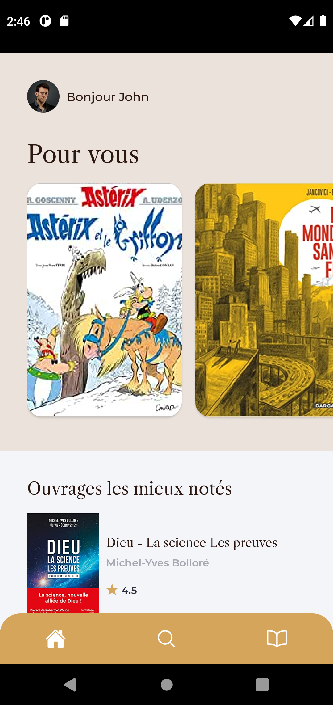
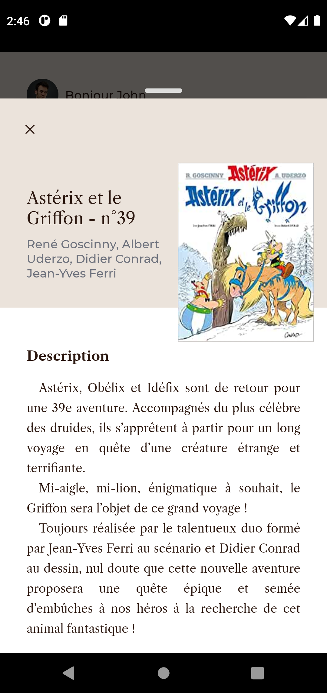

<h1 align="center">Welcome to Book Store 👋</h1>
<p>
  
  <a href="https://github.com/godart-corentin/book-store#readme" target="_blank">
    
  </a>
</p>

> A little book store project made with React Native & Typescript

### 🏠 [Homepage](https://github.com/godart-corentin/book-store#readme)

<p float="left" align="middle">


</p>

## Install

```sh
yarn install
```

## Usage

```sh
yarn android
```

## APK

- Link: [here](https://mega.nz/file/P0dTBawR#Ckj8NiAOW6oZHkcGby5mZSPab2qVAXslGrqMyneTQVg)

## Author

👤 **Corentin Godart**

- Github: [@godart-corentin](https://github.com/godart-corentin)
- LinkedIn: [@corentin-godart](https://linkedin.com/in/corentin-godart)

## 🤝 Contributing

Contributions, issues and feature requests are welcome!<br />Feel free to check [issues page](https://github.com/godart-corentin/book-store/issues).

## Show your support

Give a ⭐️ if this project helped you!
